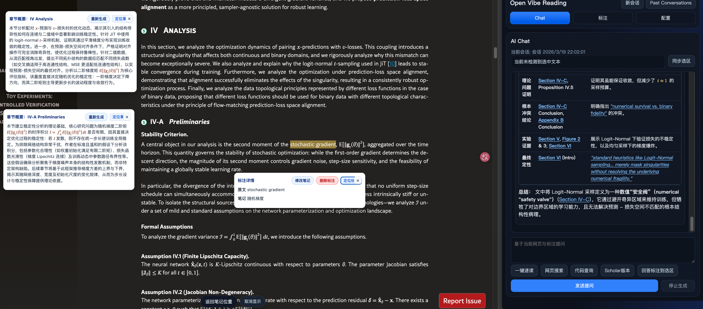
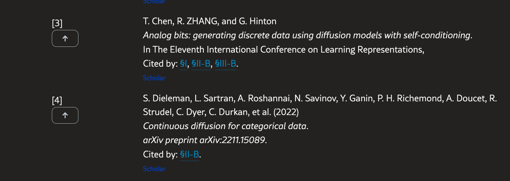

# Open Vibe Reading Chrome Extension

一个基于 Chrome Side Panel 的网页阅读助手。

## 功能

- 侧边栏 AI Chat（读取当前网页正文 + 标注上下文）
- 选区标注、高亮、定位与笔记编辑/删除
- arXiv 章节概要（`S`）与公式讲解（`ƒ`）弹窗
- 支持 Markdown 渲染（代码块、表格、引用、公式）
- 回答内自动链接到 `Section / Appendix / Figure / Table / 引用文献`
- 支持自定义 OpenAI 兼容配置：
  - `API Key`
  - `Base URL`
  - `Chat Model`
  - `Summary Model`
  - `Chatbot Name`

## 项目结构

- `manifest.json`：扩展配置（MV3）
- `background.js`：API 请求与侧边栏后台通信
- `content.js`：网页注入逻辑（选区、标注、高亮、定位、章节/公式交互）
- `sidepanel.html/js/css`：侧边栏 UI 与对话逻辑
- `vendor/katex.min.js`：公式渲染依赖

## 本地加载

1. 打开 Chrome：`chrome://extensions/`
2. 开启“开发者模式”
3. 点击“加载已解压的扩展程序”
4. 直接选择加载整个repo

## 配置

在侧边栏“配置”中填写：

- API Key
- Base URL（默认 `https://api.openai.com/v1`）
- Chat Model（默认 `gpt-4o-mini`）
- Summary Model（可与 Chat Model 不同，空置就会回滚Chat Model，分开设置有助于提高交互流畅度。）

## 数据与隐私

- API Key 仅保存在本地 `chrome.storage.local`。
- 标注与会话仅保存在本地浏览器存储。
- 项目不内置任何固定密钥或远程跟踪脚本。

## Feature Demo

### 截图中可见能力

1. 章节概要弹窗：点击标题前 `S`，支持“重新生成 / 定位章节”。
2. 公式讲解弹窗：点击公式前 `ƒ`，支持“重新生成 / 定位公式”。
3. 标注详情弹窗：支持修改笔记、删除标注、定位标注。
4. 右侧 Chat 工作台：包含一键速读、网页搜索、代码查询、Scholar 跳转、停止生成。
5. 参考文献联动：文献可跳 Scholar，并支持回跳定位。

### 截图未完整展示但已支持

1. 回答文本自动链接原文锚点（含 `Section`、`Appendix`、`Figure`、`Table`、`[ref]`）。
2. arXiv hash 解析定位（如 `#S3`、`#S3.F2`）。
3. Past Conversations 会话管理与本地缓存：支持跨网页对话。
4. 本地存储策略配置（会话上限、按天清理、一键清空）。
5. 输入交互：`Enter` 发送、`Shift+Enter` 换行。

## 开源发布（GitHub）

## 许可证

MIT，见 [LICENSE](./LICENSE)。
